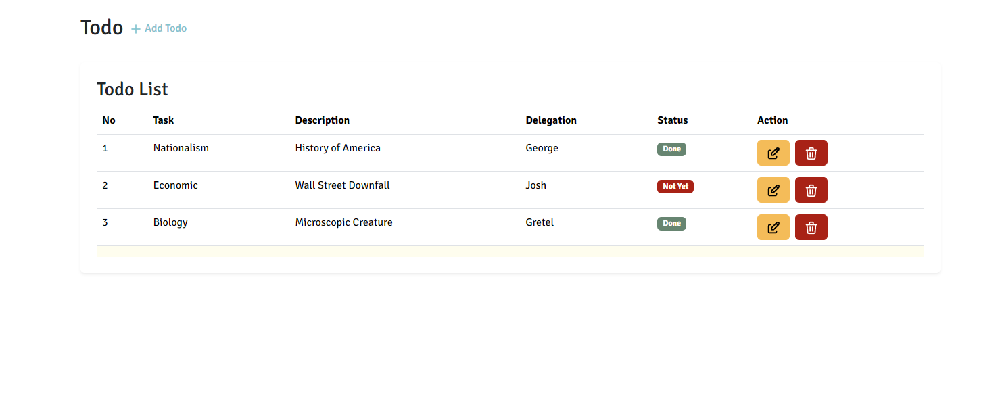

<p align="center">

<h3 align="center">Todo List App</h3>
</p>

### Built With

- [ReactJS v18.2.0](https://spring.io/)
- [NodeJS 20](https://www.oracle.com/java/technologies/javase/jdk17-archive-downloads.html)
- [Randommer.io](https://randommer.io/)

### Prerequisites

This is an example of how to list things you need to use the software and how to install them.

- Text Editor
- NodeJS
- PNPM

### Installation

1. Clone the repo
   ```sh
      https://github.com/maulanadityaa/todolist-react.git
   ```
2. Install package dependencies

   ```sh
     pnpm install
   ```

3. Run the app

   ```sh
     pnpm vite
   ```

### Screenshots App



<!-- CONTACT -->

## Contact

M Maulana Z Aditya -
Instagram - [@maulanadityaa](https://instagram.com/maulanadityaa)

Project Link: [https://github.com/maulanadityaa/todolist-react](https://github.com/maulanadityaa/todolist-react)
